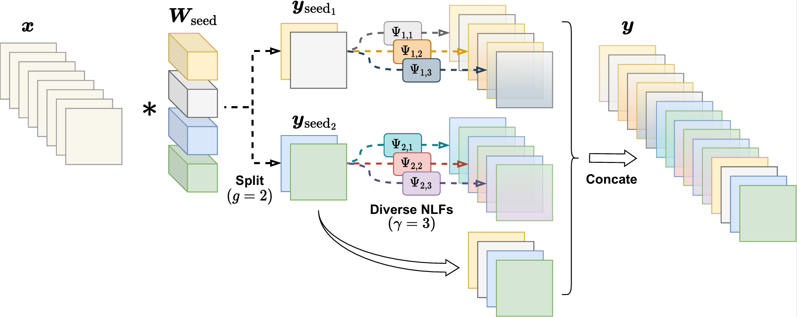

# GroupNL: Low-Resource and Robust CNN Design over Cloud and Device
GroupNL: Low-Resource and Robust CNN Design over Cloud and Device [IEEE TMC 2026]

## Overview
Compared with [Ghost Conv](https://arxiv.org/abs/1911.11907) and [Seed Feature Maps-based (SineFM) Conv](http://hal.cse.msu.edu/papers/seed-feature-map-leo-satellite-remote-sensing/), the proposed **GroupNL Conv** generates partial feature maps without using extra cheap Conv and BN, which only uses a seed Conv with the data-agnostic and hyperparameters-fixed *Nonlinear Transformation Functions (NLFs)* (i.e., Sinusoidal func) and some lightweight *Tensor Manipulation Operators* like torch.cat, torch.split, and torch.repeat.

GroupNL Conv and GroupNL Conv (Sparse) can serve as the **robust alternatives** of standard Conv and depthwise Conv in [Corrupted data](https://github.com/hendrycks/robustness), respectively.<br>
GroupNL Conv and GroupNL Conv (Sparse) also achieves a **comparable performance** to Standard Conv and depthwise Conv on standard datasets (e.g., ImageNet-1K) while consuming **fewer on-device resources** (see [our paper in IEEE TMC](https://doi.org/10.1109/TMC.2026.3655770)).



## Comparison with Standard Convs

|Method | nn.Module| #Ops | #FLOPs |
|------------------|----------------------|------|--------|
|Standard Conv      |Conv($n$, $m$, $k$, 1)    | 1 | $whmnk^2$|
|[Mono Conv](https://github.com/evoxlos/mono-cnn-pytorch)      |<font color="blue">Conv($n$, $m$, $k$, 1)</font>     |1 | $whmnk^2$|
|[Ghost Conv](https://arxiv.org/abs/1911.11907)        |<font color="blue">Conv($n$, $\frac{m}{r}$, $k$, 1)</font>, <font color="red">Conv($\frac{m}{r}$, $\frac{m(r-1)}{r}$, $d$, $\frac{m}{r}$)</font>    | 2 |$wh\frac{m}{r}(nk^2+(r−1)d^2)$ |
|[SineFM Conv](http://hal.cse.msu.edu/papers/seed-feature-map-leo-satellite-remote-sensing/)           |<font color="blue">Conv($n$, $\frac{m}{r}$, $k$, 1)</font>, <font color="red">Conv($\frac{tm}{r}$, $\frac{m(r-1)}{r}$, 1, $\frac{m}{r}$)</font>, <font color="orange">BN($\frac{m}{r}$) $\times t$</font>|2+t|$wh\frac{m}{r}(nk^2+t(r+1))$|
|GroupNL Conv   |<font color="blue">Conv($n$, $\frac{m}{r}$, $k$, 1)</font>     |1|$wh\frac{m}{r}nk^2$ |
|Depthwise Conv       |<font color="blue">Conv($n$, $n$, $k$, $n$)</font>     |1|$whn^2k^2\frac{1}{n}$|
|GroupNL Conv (Sparse)         |<font color="blue">Conv($n$, $\frac{n}{r}$, $k$, $\xi$)</font>     |1|$whn^2k^2\frac{1}{r\xi}$|

For the Convolution with Conv($n$, $m$, $k$, $g$), height is $h$, width is $w$, the No. of groups is $g$.<br>
For Ghost/SineFM/GroupNL Conv, $r$ is reduction ratio. <br>
For Ghost Conv, $d$ is the kernel size of cheap Conv. <br>
For GroupNL Conv (Sparse), $\xi$=Gcd($n$, $\frac{n}{r}$) is the No. of groups.

## Environment

Python >= 3.8, PyTorch >= 1.10, but not strictly required

## Datasets

The standard dataset [ImageNet-1K](https://huggingface.co/datasets/ILSVRC/imagenet-1k), and corrupted dataset [ImageNet-C](https://github.com/hendrycks/robustness)

## Training

The path of dataset is set by two args --data-dir and --machine in ddp_train.py (see line 363-365). <br>
These scripts serve for the 8-RTX4090 GPUs DDP training with PyTorch.

*GroupNL ResNet-101*
```bash
python3 -m torch.distributed.launch --nproc_per_node=8 --master_port 25335 ddp_train.py --model gnl_resnet101 --batch-size 128 --epochs 300 --drop-path 0.1 --amp --output ./your/output/path
```

*GroupNL MobileNet-V3*
```bash
python3 -m torch.distributed.launch --nproc_per_node=8 --master_port 25335 ddp_train.py --model mobilenetv3_gnl_large_100 -b 128 --sched step --epochs 600 --decay-epochs 2.4 --decay-rate .973 --opt rmsproptf --opt-eps .001 -j 8 --warmup-lr 1e-6 --weight-decay 1e-5 --drop 0.2 --drop-path 0.2 --model-ema --model-ema-decay 0.9999 --aa rand-m9-mstd0.5 --remode pixel --reprob 0.2 --amp --lr .064 --lr-noise 0.42 0.9 --output ./your/output/path
```

*GroupNL MobileNet-V2*
```bash
python3 -m torch.distributed.launch --nproc_per_node=8 --master_port 25335 ddp_train.py --model mobilenetv2_gnl_100 -b 128 --sched step --epochs 450 --decay-epochs 2.4 --decay-rate .97 --opt rmsproptf --opt-eps .001 -j 8 --warmup-lr 1e-6 --weight-decay 1e-5 --drop 0.2 --drop-path 0.2  --aa rand-m9-mstd0.5 --remode pixel --reprob 0.2 --amp --lr .064 --output ./your/output/path
```

*GroupNL EfficientNet-Lite0*
```bash
python3 -m torch.distributed.launch --nproc_per_node=8 --master_port 25335 ddp_train.py --model efficientnet_gnl_lite0 --batch-size 128 --sched step --epochs 450 --decay-epochs 2.4 --decay-rate .97 --opt rmsproptf --opt-eps .001 -j 8 --warmup-lr 1e-6 --weight-decay 1e-5 --drop 0.2 --drop-path 0.2 --model-ema --model-ema-decay 0.9999 --aa rand-m9-mstd0.5 --remode pixel --reprob 0.2 --amp --lr .064 --output ./your/output/path
```

*GroupNL EfficientNetV2-Small*
```bash
python3 -m torch.distributed.launch --nproc_per_node=8 --master_port 25335 ddp_train.py --model efficientnetv2_gnl_s -b 128 --sched step --epochs 450 --decay-epochs 2.4 --decay-rate .97 --opt rmsproptf --opt-eps .001 -j 8 --warmup-lr 1e-6 --weight-decay 1e-5 --drop 0.2 --drop-path 0.2  --aa rand-m9-mstd0.5 --remode pixel --reprob 0.2 --amp --lr .064 --output ./your/output/path
```

*GroupNL EfficientNet-ES*
```bash
python3 -m torch.distributed.launch --nproc_per_node=8 --master_port 25335 ddp_train.py --model efficientnet_gnl_es -b 128 --sched step --epochs 450 --decay-epochs 2.4 --decay-rate .97 --opt rmsproptf --opt-eps .001 -j 8 --warmup-lr 1e-6 --weight-decay 1e-5 --drop 0.2 --drop-path 0.2  --aa rand-m9-mstd0.5 --remode pixel --reprob 0.2 --amp --lr .064 --output ./your/output/path
```

## Validation

The val_imagenet_c.py will validate the last epoch's checkpoint from training in ./your/checkpoint/dir/path. <br>
The path of ImageNet-C dataset is set by the args --data-dir in val_imagenet_c.py. <br>
Example:

*GroupNL EfficientNet-ES in ImageNet-C*
```bash
python3 val_imagenet_c.py --model efficientnet_gnl_es --checkpoint ./your/checkpoint/dir/path --output ./your/output/path --output-dir ./your/imgc/output/path
```

## Publication

Chuntao Ding<sup>#</sup>, Jianhang Xie<sup>#,</sup>\*, Junna Zhang\*, Salman Raza, Shangguang Wang, Jiannong Cao, “GroupNL: Low-Resource and Robust CNN Design over Cloud and Device,” ***IEEE Transactions on Mobile Computing***, Accepted, 2026.

#: Co-first author; \*: Corr. author.

URL: [DOI](https://doi.org/10.1109/TMC.2026.3655770), [ArXiv](https://arxiv.org/abs/2506.12335)

```bibtex
@article{ding.tmc2026groupnl,
  author={Ding, Chuntao and Xie, Jianhang and Zhang, Junna and Raza, Salman and Wang, Shangguang and Cao, Jiannong},
  journal={IEEE Transactions on Mobile Computing}, 
  title={GroupNL: Low-Resource and Robust CNN Design over Cloud and Device}, 
  year={2026},
  volume={},
  number={},
  pages={1-15},
  doi={10.1109/TMC.2026.3655770}
}
```

## Acknowledgement

The implementation is built on top of https://github.com/huggingface/pytorch-image-models <br>
The training scripts references https://huggingface.co/docs/timm/training_script
